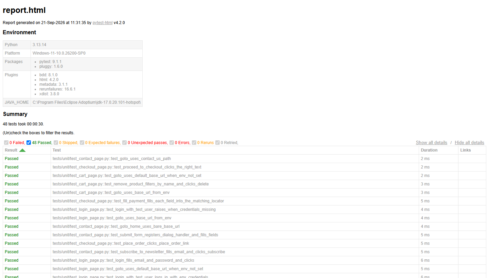

# 🧪 QA Pytest + Playwright - Automation Exercise


[](https://codecov.io/gh/ThomasTDS/qa-pytest-sd)


## Descrição

Este repositório contém testes automatizados do site **[automationexercise.com](https://automationexercise.com)** utilizando **Playwright**, **pytest-bdd (BDD/Gherkin)** e **Page Object Model (POM)**.

É a versão em **Python** do [qa-playwright-sd](https://github.com/ThomasTDS/qa-playwright-sd), que cobre os mesmos cenários e a mesma arquitetura (POM + Gherkin), originalmente escrito em TypeScript. A ideia não é um projeto novo do zero: os arquivos `.feature` (Gherkin) são praticamente idênticos entre os dois repositórios — o que muda é a linguagem e as ferramentas usadas para implementar os steps e os Page Objects.



---

## Estrutura do Projeto

```text
qa-pytest-sd/
├── .github/
│   ├── ISSUE_TEMPLATE/    # Template de bug report
│   ├── workflows/         # Pipeline de CI (GitHub Actions)
│   ├── dependabot.yml     # Atualização automática de dependências
│   └── PULL_REQUEST_TEMPLATE.md  # Template de Pull Request
├── docs/
│   ├── criterios-aceite/  # História de usuário + regra de negócio por test case
│   ├── images/            # Screenshots usados no README
│   └── test-cases.md      # Matriz de rastreabilidade de test cases
├── features/              # Cenários em Gherkin (.feature), compartilhados com o qa-playwright-sd
├── steps/                 # Implementação dos steps (pytest-bdd)
├── pages/                 # Page Objects (LoginPage, RegisterPage, ...)
├── tests/                 # Arquivos que ligam cada feature aos seus steps (E2E) e testes unitários (tests/unit/)
├── reports/               # Relatório HTML gerado a cada execução (não versionado)
├── allure-results/        # Dados brutos do Allure Report (não versionado)
├── conftest.py            # Fixtures do pytest (navegador, página, screenshot e trace em falha)
├── pyproject.toml         # Configuração do pytest, ruff e mypy
├── requirements.txt       # Dependências do projeto
├── .env.example           # Modelo de variáveis de ambiente
├── Dockerfile             # Imagem para rodar os testes containerizados
├── SECURITY.md            # Política de segurança do repositório
├── LICENSE                # Licença MIT
└── README.md              # Este arquivo
```

---

### Clonar Repositório

```
git clone https://github.com/ThomasTDS/qa-pytest-sd.git

cd qa-pytest-sd
```

### Criar ambiente virtual e instalar dependências

Requer Python 3.12 ou superior.

```
python -m venv .venv

# Windows
.venv\Scripts\activate

# Linux/macOS
source .venv/bin/activate

pip install -r requirements.txt
```

### Instalar navegadores do Playwright

```
playwright install
```

### Configuração de credenciais (.env)

Os cenários de login usam uma conta já existente no automationexercise.com, definida por variável de ambiente (nunca hardcoded no código). Copie `.env.example` para `.env` (arquivo não versionado) e preencha:

```
BASE_URL=https://automationexercise.com/
HEADLESS=false
TEST_USER_EMAIL=
TEST_USER_PASSWORD=
```

No CI, essas mesmas variáveis vêm de GitHub Secrets (`TEST_USER_EMAIL`/`TEST_USER_PASSWORD`), configurados no repositório.

### Rodar com Docker

O `Dockerfile` usa a imagem oficial do Playwright para Python (já com Chromium, Firefox e WebKit instalados), então não é preciso instalar Python ou navegadores localmente.

```bash
docker build -t qa-pytest-sd .

docker run --rm --env-file .env -v "$(pwd)/reports:/app/reports" qa-pytest-sd
```

O `--env-file .env` repassa as credenciais de teste para o container, e o volume em `reports/` traz o relatório HTML gerado de volta para a máquina host. Para rodar em outro navegador ou outro comando, passe a variável ou o comando por cima do `CMD` padrão, por exemplo:

```bash
docker run --rm --env-file .env -e BROWSER=firefox -v "$(pwd)/reports:/app/reports" qa-pytest-sd
```

### Rodar todos os testes

```
pytest
```

**NOTA:** _Por padrão, os testes rodam com o navegador visível (headless = false). Para rodar em modo headless (ex.: como no CI), use a variável de ambiente `HEADLESS`:_

```
# PowerShell
$env:HEADLESS="true"; pytest

# bash
HEADLESS=true pytest
```

### Rodar em outro navegador

Por padrão os testes rodam no **Chromium**. Para rodar em **Firefox** ou **WebKit**, defina `BROWSER` (garanta antes que o navegador está instalado — veja "Instalar navegadores do Playwright"):

```
# PowerShell
$env:BROWSER="firefox"; pytest

# bash
BROWSER=firefox pytest
```

Valores aceitos: `chromium` (padrão), `firefox`, `webkit`.

Os testes de API (`@api`) não usam navegador, então não dependem de `BROWSER`. No CI, eles rodam só no Chromium; para pulá-los localmente, use `pytest -m "not api"`.

### Rodar em paralelo

Os cenários são independentes entre si (cada um abre seu próprio navegador), então rodam bem em paralelo via **pytest-xdist**. O CI já roda assim (`-n auto`, que usa todos os cores disponíveis no runner):

```
pytest -n auto
```

Para um número fixo de workers, use `-n 4` (ou o valor desejado) no lugar de `auto`.

### Rodar só o smoke test

O cenário `TC-007` (checkout completo) é marcado com `@smoke` e cobre login, produtos, carrinho e checkout em um único fluxo ponta-a-ponta:

```
pytest -m smoke
```

### Rodar só os testes unitários

Além dos cenários E2E (BDD, contra o site real), `tests/unit/` cobre a lógica dos Page Objects — leitura de `BASE_URL`, montagem de seletores, condicionais como o campo `country` opcional — com o `Page` do Playwright mockado. Não abrem navegador, não dependem de rede e rodam em segundos:

```
pytest -m unit
```

### Rodar contra outra URL

Por padrão os testes apontam para `https://automationexercise.com/`. Para rodar contra outro ambiente, defina `BASE_URL`:

```
# PowerShell
$env:BASE_URL="https://outro-ambiente.com/"; pytest

# bash
BASE_URL=https://outro-ambiente.com/ pytest
```

### Relatório HTML

```
pytest --html=reports/report.html --self-contained-html
```

Cada execução gera `reports/report.html` (não versionado) com o resultado dos cenários. Testes que falham têm automaticamente um print da tela no momento da falha anexado ao relatório, para facilitar o diagnóstico.

Além do print, cada teste que falha também salva um **trace navegável do Playwright** em `traces/` (não versionado) — grava screenshots, snapshots do DOM e requisições de rede durante todo o cenário, não só o instante da falha. O caminho do arquivo aparece no próprio relatório HTML. Para abrir:

```
playwright show-trace traces/<arquivo>.zip
```

### Relatório Allure

Além do HTML do pytest, é possível gerar dados para o [Allure Report](https://allurereport.org/) em `allure-results/` (não versionado):

```
pytest --alluredir=allure-results
```

Gerar e visualizar o relatório requer o [Allure Commandline](https://allurereport.org/docs/install/) instalado localmente (não é um pacote pip, é uma ferramenta Java separada — via Scoop no Windows: `scoop install allure`, via Homebrew no macOS/Linux: `brew install allure`, ou baixando o `.zip`/`.tgz` da [página de releases](https://github.com/allure-framework/allure2/releases)):

```
allure generate allure-results --clean -o allure-report   # gera allure-report/ a partir de allure-results/
allure open allure-report                                  # abre o relatório gerado no navegador
# ou, sem gerar antes:
allure serve allure-results
```

O Allure agrupa os cenários por suíte, mostra o status de cada execução e anexa os mesmos extras do relatório HTML (print e trace em falha, nota de acessibilidade quando o axe-core encontra violações) — é mais navegável que o HTML simples do pytest-html para investigar uma suíte grande ou comparar execuções.

### Cobertura de código

Para medir quais linhas dos Page Objects e dos steps são executadas pela suíte:

```
pytest --cov                                  # resumo no terminal, com linhas não cobertas
pytest --cov --cov-report=html                # gera htmlcov/index.html com o detalhe por arquivo
```

A cobertura considera `pages/` e `steps/` (configurado em `pyproject.toml`). O backend do coverage é o `sysmon`, porque o Playwright sync API usa greenlets e o tracer padrão perde linhas executadas logo após chamadas ao navegador — com o padrão, `api_page.py` aparecia com ~69% em vez de ~98%.

Uma cobertura alta não garante que os cenários verificam o comportamento certo; use o relatório para achar caminhos que nenhum teste exercita, não como meta.

No CI, a cobertura é medida na rodada do Chromium e enviada ao [Codecov](https://codecov.io/gh/ThomasTDS/qa-pytest-sd), que alimenta o badge do topo deste README. O envio exige o secret `CODECOV_TOKEN`; sem ele, o CI segue verde, mas o badge não atualiza.

### Lint, formatação e checagem de tipos

O projeto usa **ruff** (lint + formatação) e **mypy** (checagem de tipos):

```
ruff check .           # verifica problemas de lint
ruff check . --fix     # corrige o que for possível automaticamente
ruff format .          # formata todos os arquivos
ruff format --check .  # só verifica, sem alterar (usado no CI)
mypy .                 # verifica erros de tipos
```

Para rodar essas checagens automaticamente antes de cada commit, instale o hook do **pre-commit** (já incluso no `requirements.txt`):

```
pre-commit install
```

A partir daí, todo `git commit` roda `ruff check --fix`, `ruff format` e `mypy` nos arquivos alterados. Para rodar manualmente contra o repositório inteiro:

```
pre-commit run --all-files
```

---

### Estrutura de Testes e Padrões Aplicados

- BDD / Gherkin: cenários claros e legíveis em `.feature`, compartilhados com o projeto irmão em TypeScript.
- Page Object Model (POM): separação de responsabilidades, com Pages encapsulando elementos e ações.
- Testes End-to-End (E2E): simulação de fluxos reais de usuário.
- Testes de API: validação direta do contrato da API pública do site (`features/api.feature`), sem passar pela UI — mais rápidos e menos frágeis para verificar regras de negócio no back-end.
- Massa de dados dinâmica: nome, empresa, endereço e telefone usados em cadastro (UI e API) são gerados a cada execução com [Faker](https://faker.readthedocs.io/) (locale `pt_BR`), em vez de valores fixos.
- Acessibilidade: páginas-chave (login, produtos) são varridas com [axe-core](https://github.com/dequelabs/axe-core) via [axe-playwright-python](https://pypi.org/project/axe-playwright-python/), verificando violações de impacto `critical`/`serious`. É QA passivo — violações encontradas viram nota no relatório HTML, sem quebrar o teste.

### Instabilidade do site de terceiros

O site testado (automationexercise.com) não é controlado por este projeto, e às vezes responde com erros de servidor (HTTP 5xx) para algumas requisições, principalmente no WebKit. Nesses casos, a página fica presa numa tela de erro e o cenário falharia mesmo com o código correto.

Para não mascarar isso com falhas espúrias, algumas etapas repetem a ação com limite fixo (2 tentativas):

- **Logout**: se a página não redireciona para `/login`, é recarregada.
- **Cadastro e remoção de conta**: se o formulário não avança ou a confirmação não aparece, a etapa é repetida.
- **Produtos e busca**: se a página de produtos ou de resultados não carrega, é recarregada.
- **Adicionar ao carrinho**: o clique é repetido apenas quando o site responde 5xx. Como o item não foi adicionado nesse caso, repetir não duplica nada.

Cada repetição aparece como **nota no relatório HTML e no Allure**, no próprio cenário. Assim, um cenário que passou só depois de repetir continua visível para quem analisa a execução.

Os testes que precisaram de reexecução do pytest-rerunfailures (`--reruns 1`) também são registrados em `reports/flaky-tests.tsv`, e o CI publica um resumo com esses casos.

Repetir uma etapa não corrige o site. Se a instabilidade aumentar, o relatório mostra quais etapas estão repetindo com mais frequência.


---

### CI/CD

O projeto roda automaticamente via GitHub Actions (`.github/workflows/tests.yml`) a cada push/PR para a `main` e diariamente às 06:00 UTC. Antes dos testes, o CI valida lint (`ruff check`), formatação (`ruff format --check`) e tipos (`mypy`), quebrando o build se algo estiver fora do padrão. A suíte roda três vezes — uma por navegador (Chromium, Firefox e WebKit) — cada uma em paralelo (`pytest -n auto`, via pytest-xdist), acumulando os resultados das três em um único relatório Allure. O relatório HTML de cada navegador e o relatório Allure consolidado são publicados como artifacts da execução. Cenários que falham são reexecutados automaticamente uma vez (`--reruns 1`), para absorver instabilidades pontuais de rede sem mascarar bugs reais de código.

Dependências pip e os binários dos navegadores do Playwright são cacheados entre execuções (`actions/cache`, invalidado automaticamente quando `requirements.txt` muda), o que evita rebaixar ~200MB de navegadores a cada run.

### Segurança da pipeline

- `pip-audit` roda no CI a cada execução, quebrando o build se houver vulnerabilidade conhecida em alguma dependência.
- **Dependabot** ativo (`.github/dependabot.yml`): atualizações automáticas semanais de dependências pip e das actions do workflow.

A `main` é protegida: mudanças precisam passar por Pull Request com o check de testes verde.

---

### Documentação de QA

- Template de bug report em `.github/ISSUE_TEMPLATE/bug_report.md`, com severidade (impacto técnico) e prioridade (urgência de correção) tratadas como campos separados, e causa raiz preenchida só após investigação real.
- Template de Pull Request em `.github/PULL_REQUEST_TEMPLATE.md`, com checklist de teste local antes de abrir o PR.
- Matriz de rastreabilidade em `docs/test-cases.md`, ligando cada test case ao cenário `.feature` correspondente via tag `@TC-XXX`.
- Critérios de aceite (história de usuário + regra de negócio por trás de cada test case) em `docs/criterios-aceite/`.
- Política de segurança do repositório em `SECURITY.md` (escopo, versões suportadas, como reportar).

---

## Licença

Distribuído sob a licença MIT. Veja [LICENSE](LICENSE) para mais detalhes.
